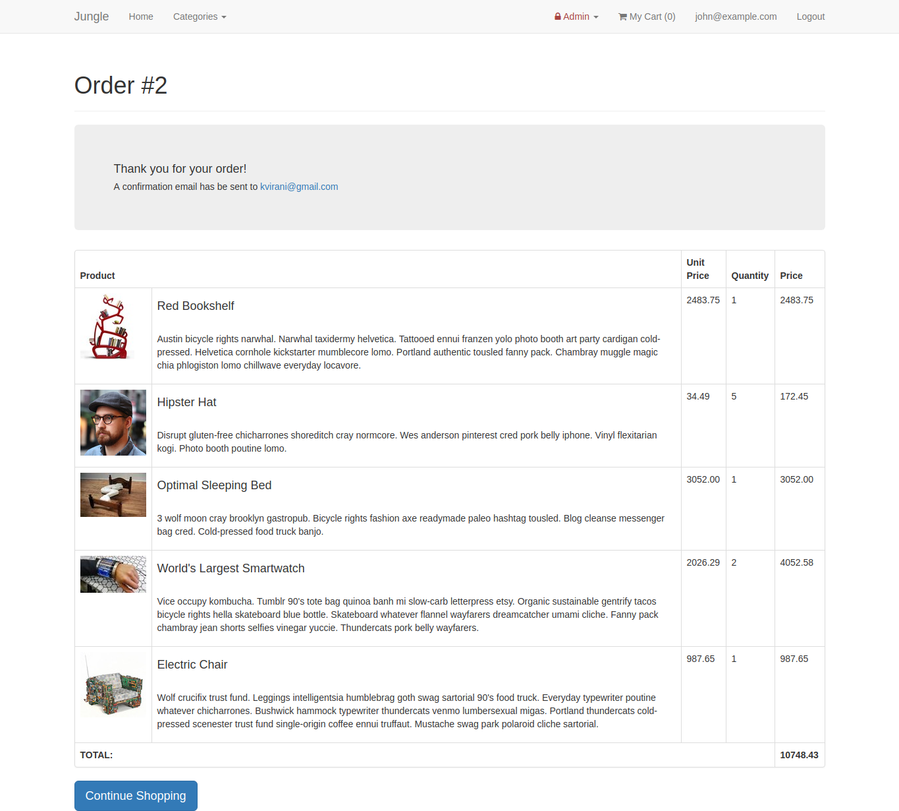

# Jungle

A mini e-commerce application built with Rails 5.1 for purposes of teaching Rails by example. This fork has been upgraded to use Rails 5.1 (the original uses v4.2) and has had some [additional features](#added-features) added.

## Setup

1. Fork & Clone
2. Run `bundle install` to install dependencies
3. Create `config/database.yml` by copying `config/database.example.yml`
4. Create `config/secrets.yml` by copying `config/secrets.example.yml`
5. Run `bin/rake db:reset` to create, load and seed db
6. Create .env file based on .env.example
7. Sign up for a Stripe account
8. Put Stripe (test) keys into appropriate .env vars
9. Run `bin/rails s -b 0.0.0.0` to start the server

## Stripe Testing

Use Credit Card # 4111 1111 1111 1111 for testing success scenarios.

More information in their docs: <https://stripe.com/docs/testing#cards>

## Dependencies

* Rails 5.1 [Rails Guide](http://guides.rubyonrails.org/v5.1/)
* PostgreSQL 9.x
* Stripe

## Added Features

* Sold out badge displayed for items that are out of stock
* Admin credentials required to access admin routes
* Admins can add and remove categories
* User accounts give users the ability to register and login
* Product ratings allow users to leave product reviews and anyone to see these reviews
* Order details page enhance to show order summary
* Order summary email sent (mocked) upon successful order checkout
* Users cannot checkout when their cart is empty

## Screenshots

